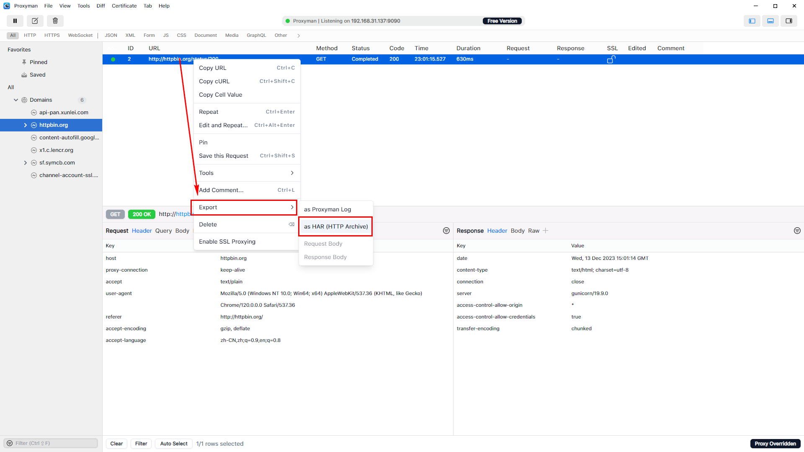

# 简介

tep是Try Easy Pytest的首字母缩写，帮你轻松上手pytest。

如果你选择pytest做自动化，又不知道该怎么设计框架，那么可以学习和使用tep。

特点：
- 关键字驱动
- HAR包转换pytest用例

# 安装

Python版本：12.1，下载：https://www.python.org/downloads/

创建虚拟环境：`python -m venv venv`

激活虚拟环境，Windows用户：`activate.bat` Mac用户：`source venv/bin/activate`

安装tep：`pip install tep`

验证安装成功：`tep -V`


``` text
Current Version: V2.2.2

 ____o__ __o____   o__ __o__/_   o__ __o
  /   \   /   \   <|    v       <|     v\
       \o/        < >           / \     <\
        |          |            \o/     o/
       < >         o__/_         |__  _<|/
        |          |             |
        o         <o>           <o>
       <|          |             |
       / \        / \  _\o__/_  / \
```

# 手动编写用例

执行命令`tep new demo`创建项目脚手架，demo为项目名称

```
Created folder: demo
Created folder: demo/case
Created folder: demo/data
Created folder: demo/data/har
Created folder: demo/report
Created file:   demo/replay.py
Created file:   demo/run.py
Created file:   demo/conftest.py
Created file:   demo/pytest.ini
Created file:   demo/.gitignore
Created file:   demo/case/__init__.py
Created file:   demo/case/test_demo.py
Created file:   demo/data/UserDefinedVariables.yaml
```

在case目录中，新建文件test_demo.py

定义函数：

```python
def test():
```

输入关键字`HTTPRequestKeyword`：

```python
def test(HTTPRequestKeyword):
```

填写请求方式和URL：

```python
HTTPRequestKeyword("get", url="http://httpbin.org/status/200")
```

把响应存入response对象：

```python
response = HTTPRequestKeyword("get", url="http://httpbin.org/status/200")
```

添加断言：

```python
assert response.status_code == 200
```

完整代码：

```python
def test(HTTPRequestKeyword):
    response = HTTPRequestKeyword("get", url="http://httpbin.org/status/200")
    assert response.status_code == 200
```

# 抓包转换用例

执行命令`tep new demo`创建项目脚手架，demo为项目名称

```
Created folder: demo
Created folder: demo/case
Created folder: demo/data
Created folder: demo/data/har
Created folder: demo/report
Created file:   demo/replay.py
Created file:   demo/run.py
Created file:   demo/conftest.py
Created file:   demo/pytest.ini
Created file:   demo/.gitignore
Created file:   demo/case/__init__.py
Created file:   demo/case/test_demo.py
Created file:   demo/data/UserDefinedVariables.yaml
```

通过Proxyman等工具抓包，导出为HAR包：



将HAR包放入`data/har`目录中，执行replay.py

在`case/replay`目录下就能看到自动生成的pytest用例。

# HTTP请求

一、GET
1.1 GET

```
HTTPRequestKeyword("get", url="")
```

1.2 GET、Header

```
HTTPRequestKeyword("get", url="", headers={})
```

1.3 GET、Header、查询参数
1.3.1 直接拼在url后面

```
HTTPRequestKeyword("get", url="" + "?a=1&b=2", headers={})
```

1.3.2 JSON转查询参数

```
from urllib.parse import urlencode

query = {}
request("get", url="" + "?" + urlencode(query), headers={})
```

1.4 GET、Header、表单

```
HTTPRequestKeyword("get", url="", headers={}, params={})
```

二、POST
2.1 POST

```
HTTPRequestKeyword("post", url="")
```

2.2 POST、Header

```
HTTPRequestKeyword("post", url="", headers={})
```

2.3 POST、Header、JSON

```
HTTPRequestKeyword("post", url="", headers={}, json={})
```

2.4 POST、Header、表单

```
HTTPRequestKeyword("post", url="", headers={}, data={})
```

三、PUT
3.1 PUT

```
HTTPRequestKeyword("put", url="")
```

3.2 PUT、Header

```
HTTPRequestKeyword("put", url="", headers={})
```

3.3 PUT、Header、JSON

```
HTTPRequestKeyword("put", url="", headers={}, json={})
```

3.4 PUT、Header、表单

```
HTTPRequestKeyword("put", url="", headers={}, data={})
```

四、DELETE
4.1 DELETE

```
HTTPRequestKeyword("delete", url="")
```

4.2 DELETE、Header

```
HTTPRequestKeyword("delete", url="", headers={})
```

五、上传文件
5.1 上传图片

```
files = {
    'file': ('filename', open('filepath', 'rb'), 'image/jpeg')
}
HTTPRequestKeyword("post", url="", headers={}, files=files)
```
注意requests会自动添加`{"Content-Type":"multipart/form-data"}`，使用headers不能再重复添加

5.2上传zip

```
files = {
    'file': ('filename', open('filepath', 'rb'), 'application/x-zip-compressed')
}
HTTPRequestKeyword("post", url="", headers={}, files=files)
```


# 🌟更新日志🌟

- ✅V2.2.3
  - case文件夹下使用中文命名，目录名+模块名（包名+模块名）
  - 修改pytest配置python_files = *.py，识别任意名称
  - 脚手架添加中文命名示例
  - 脚手架添加场景测试用例
  - 脚手架添加Mock服务工具
  - 脚手架添加fixture\fixture_login.py
  - requests日志耗时改为毫秒
- V2.2.2
  - 基于Python12.1版本，poetry update
  - 移除allure报告，去掉--tep-reports命令行参数
  - 定制pytest-html报告内容和样式，单个HTML文件查看报告
- V2.2.1
  - 新增关键字StringKeyword，url使用`${}`替换变量
  - 回放配置添加hookVar，可自定义变量池
  - 回放配置添加hookUrl，可自定义url
  - 回放配置添加hookHeaders，可自定义headers
  - 修复BUG，回放对比生成HTML，删除顶部多余td
- V2.2.0
  - 重要：BodyKeyword改名为JSONKeyword
  - 重要：headers和body均为String，多行字符串表示，用JSONKeyword转为dict
  - 重要：新增关键字VarKeyword，与JSONKeyword结合使用，实现`${}`用法，在字符串中直接替换变量
  - 重要：去掉Result类，无须指定返回类型和定义中间变量，让关键字返回动态起来
  - 抓包自动生成用例，配置新增jsonIndent，默认设置为4，换行且4个空格缩进，可设置None不换行
  - 抓包自动生成用例，配置mode改名为overwrite，默认跳过，True则覆盖
  - 抓包自动生成用例，根据新特性，优化模版代码
- V2.1.2
  - 优化Har，支持指定目录，按增量/全量转换pytest用例
- V2.1.1
  - HAR包转换pytest用例功能纳入脚手架，主推，内容写入教程“快速入门”章节
  - 脚手架.gitignore文件后缀问题修复
- V2.1.0
  - 支持HTTP/2协议，httpx库实现
  - 支持HAR包转换为pytest用例，支持HTTP1和HTTP2协议
  - 基于HAR包的回放对比，字段对比输出TXT，文本对比输出HTML
  - 自定义日志对象，logger和sys_logger输出到用户/系统不同文件
  - 支持接口重试，CODE码/异常匹配，超时设置等，tenacity库实现
- V2.0.1 cli修改，查看版本`tep -V`，V大写，创建脚手架`tep new demo`，使用new
- V2.0.0 tep关键字驱动框架
- V1.0.0 tep小工具完整教程
- V0.2.3 tep小工具首次开源